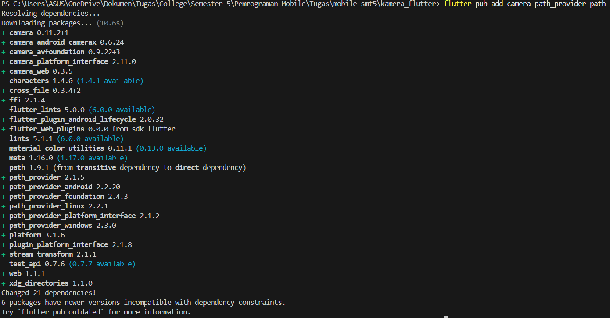
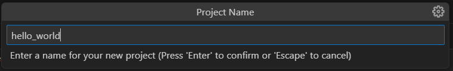
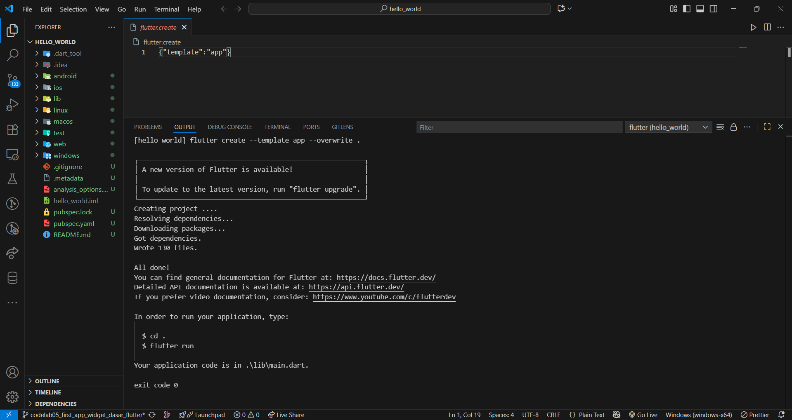

# Pemrograman Mobile

**Nama** : Rio Tri Prayogo

**NIM** : 2341720236

## 12 | Lanjutan State Management dengan Streams

### Praktikum

**Praktikum 1: Dart Streams**<br>

Langkah 1: Buat Project Baru

Buatlah sebuah project flutter baru dengan nama stream_nama (beri nama panggilan Anda) di folder week-12/src/ repository GitHub Anda.

Langkah 2: Buka file main.dart

Ketiklah kode seperti berikut ini.

```
import 'package:flutter/material.dart';

void main() {
  runApp(const MyApp());
}

class MyApp extends StatelessWidget {
  const MyApp({super.key});

  @override
  Widget build(BuildContext context) {
    return MaterialApp(
      title: 'Stream - Rio',
      theme: ThemeData(primarySwatch: Colors.deepPurple),
      home: const StreamHomePage(),
    );
  }
}

class StreamHomePage extends StatefulWidget {
  const StreamHomePage({super.key});

  @override
  State<StreamHomePage> createState() => _StreamHomePageState();
}

class _StreamHomePageState extends State<StreamHomePage> {
  @override
  Widget build(BuildContext context) {
    return Container();
  }
}
```

> Soal 1
>
> - Tambahkan nama panggilan Anda pada title app sebagai identitas hasil pekerjaan Anda.
>   > answer
> - Gantilah warna tema aplikasi sesuai kesukaan Anda.
>   > answer
> - Lakukan commit hasil jawaban Soal 1 dengan pesan "W12: Jawaban Soal 1"

Langkah 3: Buat file baru stream.dart

Buat file baru di folder lib project Anda. Lalu isi dengan kode berikut.

```
import 'package:flutter/material.dart';

class ColorStream {

}
```

Langkah 4: Tambah variabel colors

Tambahkan variabel di dalam class ColorStream seperti berikut.

```
  final List<Color> colors = [
    Colors.blueGrey,
    Colors.amber,
    Colors.deepPurple,
    Colors.lightBlue,
    Colors.teal,
  ];
```

> Soal 2
> Tambahkan 5 warna lainnya sesuai keinginan Anda pada variabel colors tersebut.
>
> - Lakukan commit hasil jawaban Soal 2 dengan pesan "W12: Jawaban Soal 2"

Langkah 5: Tambah method getColors()

Di dalam class ColorStream ketik method seperti kode berikut. Perhatikan tanda bintang di akhir keyword async\* (ini digunakan untuk melakukan Stream data)

```
  Stream<Color> getColor() async* {}
```

Langkah 6: Tambah perintah yield\*

Tambahkan kode berikut ini.

```
yield* Stream.periodic(
  const Duration(seconds: 1), (int t) {
    int index = t % colors.length;
    return colors[index];
});
```

> Soal 3
>
> - Jelaskan fungsi keyword yield\* pada kode tersebut!
> - Apa maksud isi perintah kode tersebut?
> - Lakukan commit hasil jawaban Soal 3 dengan pesan "W12: Jawaban Soal 3"

Langkah 7: Buka main.dart

Ketik kode impor file ini pada file main.dart

```
import 'stream.dart';
```

Langkah 8: Tambah variabel

Ketik dua properti ini di dalam class \_StreamHomePageState

```
  Color bgColor = Colors.blueGrey;
  late ColorStream colorStream;
```

Langkah 9: Tambah method changeColor()

Tetap di file main, Ketik kode seperti berikut

```
  void changeColor() async {
    await for (var eventColor in colorStream.getColor()) {
      setState(() {
        bgColor = eventColor;
      });
    }
  }
```

Langkah 10: Lakukan override initState()

Ketika kode seperti berikut

```
  @override
  void initState() {
    super.initState();
    colorStream = ColorStream();
    changeColor();
  }
```

Langkah 11: Ubah isi Scaffold()

Sesuaikan kode seperti berikut.

```
    return Scaffold(
      appBar: AppBar(title: const Text('Stream - Rio')),
      body: Container(decoration: BoxDecoration(color: bgColor)),
    );
```

Langkah 12: Run

Lakukan running pada aplikasi Flutter Anda, maka akan terlihat berubah warna background setiap detik.

> <br><br><br><br>

> Soal 4
>
> - Capture hasil praktikum Anda berupa GIF dan lampirkan di README.
> - Lakukan commit hasil jawaban Soal 4 dengan pesan "W12: Jawaban Soal 4"

Langkah 13: Ganti isi method changeColor()

Anda boleh comment atau hapus kode sebelumnya, lalu ketika kode seperti berikut.

```
    colorStream.getColor().listen((eventColor) {
      setState(() {
        bgColor = eventColor;
      });
    });
```

> <br><br><br><br>

> Soal 5
>
> - Jelaskan perbedaan menggunakan listen dan await for (langkah 9) !
> - Lakukan commit hasil jawaban Soal 5 dengan pesan "W12: Jawaban Soal 5"
