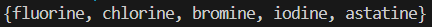
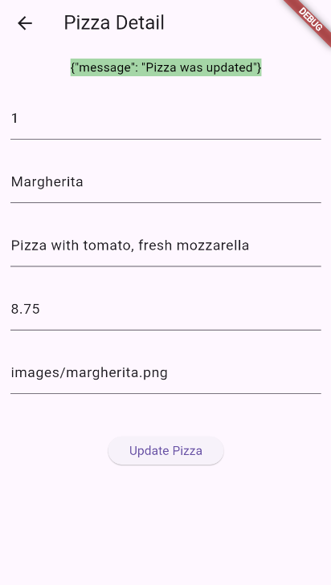

# Pemrograman Mobile

**Nama** : Rio Tri Prayogo

**NIM** : 2341720236

## 12 | Lanjutan State Management dengan Streams

### Praktikum

**Praktikum 1: Dart Streams**<br>

Langkah 1: Buat Project Baru

Buatlah sebuah project flutter baru dengan nama stream_nama (beri nama panggilan Anda) di folder week-12/src/ repository GitHub Anda.

Langkah 2: Buka file main.dart

Ketiklah kode seperti berikut ini.

```
import 'package:flutter/material.dart';

void main() {
  runApp(const MyApp());
}

class MyApp extends StatelessWidget {
  const MyApp({super.key});

  @override
  Widget build(BuildContext context) {
    return MaterialApp(
      title: 'Stream - Rio',
      theme: ThemeData(primarySwatch: Colors.deepPurple),
      home: const StreamHomePage(),
    );
  }
}

class StreamHomePage extends StatefulWidget {
  const StreamHomePage({super.key});

  @override
  State<StreamHomePage> createState() => _StreamHomePageState();
}

class _StreamHomePageState extends State<StreamHomePage> {
  @override
  Widget build(BuildContext context) {
    return Container();
  }
}
```

> Soal 1
>
> - Tambahkan nama panggilan Anda pada title app sebagai identitas hasil pekerjaan Anda.
>   > answer
> - Gantilah warna tema aplikasi sesuai kesukaan Anda.
>   > answer
> - Lakukan commit hasil jawaban Soal 1 dengan pesan "W12: Jawaban Soal 1"

Langkah 3: Buat file baru stream.dart

Buat file baru di folder lib project Anda. Lalu isi dengan kode berikut.

```
import 'package:flutter/material.dart';

class ColorStream {

}
```

Langkah 4: Tambah variabel colors

Tambahkan variabel di dalam class ColorStream seperti berikut.

```
  final List<Color> colors = [
    Colors.blueGrey,
    Colors.amber,
    Colors.deepPurple,
    Colors.lightBlue,
    Colors.teal,
  ];
```

> Soal 2
> Tambahkan 5 warna lainnya sesuai keinginan Anda pada variabel colors tersebut.
>
> - Lakukan commit hasil jawaban Soal 2 dengan pesan "W12: Jawaban Soal 2"

Langkah 5: Tambah method getColors()

Di dalam class ColorStream ketik method seperti kode berikut. Perhatikan tanda bintang di akhir keyword async\* (ini digunakan untuk melakukan Stream data)

```
  Stream<Color> getColor() async* {}
```

Langkah 6: Tambah perintah yield\*

Tambahkan kode berikut ini.

```
yield* Stream.periodic(
  const Duration(seconds: 1), (int t) {
    int index = t % colors.length;
    return colors[index];
});
```

> Soal 3
>
> - Jelaskan fungsi keyword yield\* pada kode tersebut!
> - Apa maksud isi perintah kode tersebut?
> - Lakukan commit hasil jawaban Soal 3 dengan pesan "W12: Jawaban Soal 3"

Langkah 7: Buka main.dart

Ketik kode impor file ini pada file main.dart

```
import 'stream.dart';
```

Langkah 8: Tambah variabel

Ketik dua properti ini di dalam class \_StreamHomePageState

```
  Color bgColor = Colors.blueGrey;
  late ColorStream colorStream;
```

Langkah 9: Tambah method changeColor()

Tetap di file main, Ketik kode seperti berikut

```
  void changeColor() async {
    await for (var eventColor in colorStream.getColor()) {
      setState(() {
        bgColor = eventColor;
      });
    }
  }
```

Langkah 10: Lakukan override initState()

Ketika kode seperti berikut

```
  @override
  void initState() {
    super.initState();
    colorStream = ColorStream();
    changeColor();
  }
```

Langkah 11: Ubah isi Scaffold()

Sesuaikan kode seperti berikut.

```
    return Scaffold(
      appBar: AppBar(title: const Text('Stream - Rio')),
      body: Container(decoration: BoxDecoration(color: bgColor)),
    );
```

Langkah 12: Run

Lakukan running pada aplikasi Flutter Anda, maka akan terlihat berubah warna background setiap detik.

> <br><br><br><br>

> Soal 4
>
> - Capture hasil praktikum Anda berupa GIF dan lampirkan di README.
> - Lakukan commit hasil jawaban Soal 4 dengan pesan "W12: Jawaban Soal 4"

Langkah 13: Ganti isi method changeColor()

Anda boleh comment atau hapus kode sebelumnya, lalu ketika kode seperti berikut.

```
    colorStream.getColor().listen((eventColor) {
      setState(() {
        bgColor = eventColor;
      });
    });
```

> <br><br><br><br>

> Soal 5
>
> - Jelaskan perbedaan menggunakan listen dan await for (langkah 9) !
> - Lakukan commit hasil jawaban Soal 5 dengan pesan "W12: Jawaban Soal 5"

**Praktikum 2: Stream controllers dan sinks**<br>

Langkah 1: Buka file stream.dart

Lakukan impor dengan mengetik kode ini.
```
import 'dart:async';
```

Langkah 2: Tambah class NumberStream

Tetap di file stream.dart tambah class baru seperti berikut.
```
class NumberStream {}
```

Langkah 3: Tambah StreamController

Di dalam class NumberStream buatlah variabel seperti berikut.
```
  final StreamController<int> controller = StreamController<int>();
```

Langkah 4: Tambah method addNumberToSink

Tetap di class NumberStream buatlah method ini
```
  void addNumberToSink(int number) {
    controller.sink.add(number);
  }
```

Langkah 5: Tambah method close()
```
  close() {
    controller.close();
  }
```

Langkah 6: Buka main.dart

Ketik kode import seperti berikut
```
import 'dart:async';
import 'dart:math';
```

Langkah 7: Tambah variabel

Di dalam class _StreamHomePageState ketik variabel berikut
```
  int lastNumber = 0;
  late StreamController numberStreamController;
  late NumberStream numberStream;
```

Langkah 8: Edit initState()

```
  @override
  void initState() {
    numberStream = NumberStream();
    numberStreamController = numberStream.controller;
    Stream stream = numberStreamController.stream;
    stream.listen((eventNumber) {
      setState(() {
        lastNumber = eventNumber;
      });
    });
    super.initState();
  }
```

Langkah 9: Edit dispose()

```
  @override
  void dispose() {
    numberStreamController.close();
    super.dispose();
  }
```

Langkah 10: Tambah method addRandomNumber()

```
void addRandomNumber() {
  Random random = Random();
  int myNum = random.nextInt(10);
  numberStream.addNumberToSink(myNum);
}
```

Langkah 11: Edit method build()

```
      body: SizedBox(
        width: double.infinity,
        child: Column(
          mainAxisAlignment: MainAxisAlignment.spaceEvenly,
          crossAxisAlignment: CrossAxisAlignment.center,
          children: [
            Text(lastNumber.toString()),
            ElevatedButton(
              onPressed: () => addRandomNumber(),
              child: const Text('New Random Number'),
            ),
          ],
        ),
      ),
```

Langkah 12: Run
Lakukan running pada aplikasi Flutter Anda, maka akan terlihat seperti gambar berikut.

> <br><br>

> Soal 6
> - Jelaskan maksud kode langkah 8 dan 10 tersebut!
> - Capture hasil praktikum Anda berupa GIF dan lampirkan di README.
> - Lalu lakukan commit dengan pesan "W12: Jawaban Soal 6".

Langkah 13: Buka stream.dart

Tambahkan method berikut ini.
```
  addError(){
    controller.sink.addError("error");
  }
```

Langkah 14: Buka main.dart

Tambahkan method onError di dalam class StreamHomePageState pada method listen di fungsi initState() seperti berikut ini.
```
    stream
        .listen((event) {
          setState(() {
            lastNumber = event;
          });
        })
        .onError((error) {
          setState(() {
            lastNumber = -1;
          });
        });
```        

Langkah 15: Edit method addRandomNumber()

Lakukan comment pada dua baris kode berikut, lalu ketik kode seperti berikut ini.
```
  void addRandomNumber() {
    Random random = Random();
    // int myNum = random.nextInt(10);
    // numberStream.addNumberToSink(myNum);
    numberStream.addError();
  }
```

> Soal 7
> - Jelaskan maksud kode langkah 13 sampai 15 tersebut!
> - Kembalikan kode seperti semula pada Langkah 15, comment addError() agar Anda dapat melanjutkan ke praktikum 3 berikutnya.
> - Lalu lakukan commit dengan pesan "W12: Jawaban Soal 7".

**Praktikum 3: Injeksi data ke streams**<br>

Langkah 1: Buka main.dart

Tambahkan variabel baru di dalam class _StreamHomePageState
```
  late StreamTransformer transformer;
```

Langkah 2: Tambahkan kode ini di initState

```
    transformer = StreamTransformer<int, int>.fromHandlers(
      handleData: (value, sink) {
        sink.add(value * 10);
      },
      handleError: (error, stackTrace, sink) {
        sink.add(-1);
      },
      handleDone: (sink) => sink.close(),
    );
```

Langkah 3: Tetap di initState

Lakukan edit seperti kode berikut.
```
    stream.transform(transformer).listen((event) {
      setState(() {
        lastNumber = event;
      });
    }).onError((error) {
      setState(() {
        lastNumber = -1;
      });
    });
    super.initState();
```

Langkah 4: Run
Terakhir, run atau tekan F5 untuk melihat hasilnya jika memang belum running. Bisa juga lakukan hot restart jika aplikasi sudah running. Maka hasilnya akan seperti gambar berikut ini. Anda akan melihat tampilan angka dari 0 hingga 90.

> <br><br>
