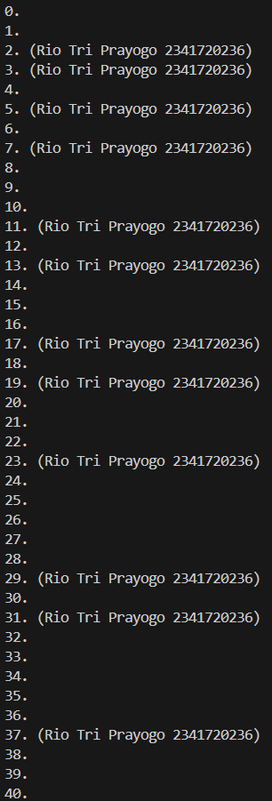

# Pemrograman Mobile

**Nama** : Rio Tri Prayogo

**NIM** : 2341720236

## 03 | Pengantar Bahasa Pemrograman Dart - Bagian 2

### Praktikum

**Praktikum 1: Menerapkan Control Flows ("if/else")**<br>
Langkah 1:
Ketik atau salin kode program berikut ke dalam fungsi main().

```
String test = "test2";
if (test == "test1") {
   print("Test1");
} else If (test == "test2") {
   print("Test2");
} Else {
   print("Something else");
}

if (test == "test2") print("Test2 again");
```

Langkah 2:
Silakan coba eksekusi (Run) kode pada langkah 1 tersebut. Apa yang terjadi? Jelaskan!

> Pada saat kode tersebut di run maka akan muncul output: <br><br> Karena kode tersebut merupakan pemilihan if else dari variabel test dimana variabel test memiliki isi test2 yang mana akan memberikan output yang sesuai dengan pemilihan yang ada.

Langkah 3:
Tambahkan kode program berikut, lalu coba eksekusi (Run) kode Anda.

```
String test = "true";
if (test) {
   print("Kebenaran");
}
```

Apa yang terjadi ? Jika terjadi error, silakan perbaiki namun tetap menggunakan if/else.

> Jika kode diatas di run maka akan muncul output: <br><br> Output error karena if else tidak memberikan sebuah nilai, jika diubah dengan memberi nilai: <br>
>
> ```
> String testing = "true";
>  if (testing == "true") {
>    print("Kebenaran");
>  }
> ```
>
> Maka akan muncul output yang sesuai yaitu: <br><br>

**_[Praktikum 1 Code](src/praktikum1.dart)_**

**Praktikum 2: Menerapkan Perulangan "while" dan "do-while"**<br>
Langkah 1:
Ketik atau salin kode program berikut ke dalam fungsi main().
```
while (counter < 33) {
  print(counter);
  counter++;
}
```
Langkah 2:
Silakan coba eksekusi (Run) kode pada langkah 1 tersebut. Apa yang terjadi? Jelaskan! Lalu perbaiki jika terjadi error.
> Pada saat kode tersebut di run maka akan muncul error: <br><br> Karena variabel counter belum di inisiasi, sebelum dijalankan harus ada inisiasi kode dengan perbaikan:
> ```
>  int counter = 0;
>  while (counter < 33) {
>    print(counter);
>    counter++;
>  }
>```
>
> Maka akan muncul output: <br><br>

Langkah 3:
Tambahkan kode program berikut, lalu coba eksekusi (Run) kode Anda.
```
do {
  print(counter);
  counter++;
} while (counter < 77);
```
Apa yang terjadi ? Jika terjadi error, silakan perbaiki namun tetap menggunakan do-while.
> Output yang muncul ketika kode diatas dijalankan yaitu: <br><br> Do-While dan While memiliki perbedaan yaitu jika Do-While akan mengeksekusi kode terlebih dahulu baru mengecek requirement atau pemilihannya, sedangkan While di cek dahulu baru dijalankan.

**_[Praktikum 2 Code](src/praktikum2.dart)_**

**Praktikum 3**<br>
Langkah 1:
Ketik atau salin kode program berikut ke dalam fungsi main().
```
for (Index = 10; index < 27; index) {
  print(Index);
}
```
Langkah 2:
Silakan coba eksekusi (Run) kode pada langkah 1 tersebut. Apa yang terjadi? Jelaskan! Lalu perbaiki jika terjadi error.
> Kode diatas pada saat di run maka akan muncul output: <br><br> Output error karena variabel index memiliki huruf kapital yang berbeda (case sensitive), bisa diperbaiki dengan menyamakan variabel sehingga memunculkan output: <br><br> Kode tersebut memunculkan infinite loop karena isi variabel index tidak berubah, dapat diperbaiki dengan mengubah di akhir dengan index++ sehingga memunculkan output: <br><br>

Langkah 3:
Tambahkan kode program berikut di dalam for-loop, lalu coba eksekusi (Run) kode Anda.
```
If (Index == 21) break;
Else If (index > 1 || index < 7) continue;
print(index);
```
Apa yang terjadi ? Jika terjadi error, silakan perbaiki namun tetap menggunakan for dan break-continue.
> Kode diatas jika digabungkan dengan langkah 1 yang sudah diperbaiki maka akan memunculkan output: <br><br> Kode tersebut dijalankan jika index==21 maka akan break/berhenti, jika >1 atau <7 maka akan continue/di skip.

**_[Praktikum 3 Code](src/praktikum3.dart)_**

**Tugas Praktikum**<br>
1. Silakan selesaikan Praktikum 1 sampai 3, lalu dokumentasikan berupa screenshot hasil pekerjaan beserta penjelasannya!
2. Buatlah sebuah program yang dapat menampilkan bilangan prima dari angka 0 sampai 201 menggunakan Dart. Ketika bilangan prima ditemukan, maka tampilkan nama lengkap dan NIM Anda.

Kumpulkan berupa link commit repo GitHub kepada dosen pengampu sesuai kesepakatan di kelas!

> Kode:
> ```
>  String nama = "Rio Tri Prayogo";
>  String nim = "2341720236";
>
>  bool isPrime(int n) {
>    if (n < 2) return false;
>    for (int i = 2; i < n; i++) {
>      if (n % i == 0) return false;
>    }
>    return true;
>  }
>
>  for (int i = 0; i <= 201; i++) {
>    print(isPrime(i) ? "$i. ($nama $nim)" : "$i.");
>  }
> ```
> Output: <br><br>

**_[Tugas Praktikum Code](src/tugas.dart)_**