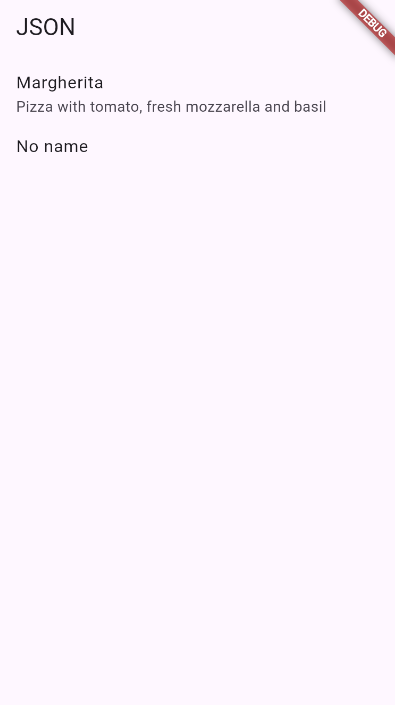

# Pemrograman Mobile

**Nama** : Rio Tri Prayogo

**NIM** : 2341720236

## 13 | Persistensi Data

### Praktikum

**Praktikum 1: Konversi Dart model ke JSON**<br>

Langkah 1: Buat Project Baru

Buatlah sebuah project flutter baru dengan nama store_data_nama (beri nama panggilan Anda) di folder week-13/src/ repository GitHub Anda.

Langkah 2: Buka file main.dart

Ketiklah kode seperti berikut ini.
```
import 'package:flutter/material.dart';

void main() {
  runApp(MyApp());
}

class MyApp extends StatelessWidget {
  const MyApp({super.key});

  @override
  Widget build(BuildContext context) {
    return MaterialApp(
      title: 'Flutter JSON Demo',
      theme: ThemeData(primarySwatch: Colors.blue),
      home: const MyHomePage(),
    );
  }
}

class MyHomePage extends StatefulWidget {
  const MyHomePage({super.key});

  @override
  State<MyHomePage> createState() => _MyHomePageState();
}

class _MyHomePageState extends State<MyHomePage> {
  @override
  Widget build(BuildContext context) {
    return Scaffold(
      appBar: AppBar(title: const Text('JSON')),
      body: Container(),
    );
  }
}
```

> Soal 1
> - Tambahkan nama panggilan Anda pada title app sebagai identitas hasil pekerjaan Anda.
> - Gantilah warna tema aplikasi sesuai kesukaan Anda.
> - Lakukan commit hasil jawaban Soal 1 dengan pesan "W13: Jawaban Soal 1"

Langkah 3: Buat folder baru assets

Buat folder baru assets di root project Anda

Langkah 4: Buat file baru pizzalist.json

Letakkan file ini di dalam folder assets, lalu salin data JSON berikut ke file tersebut.
```
[ 
    { 
      "id": 1, 
      "pizzaName": "Margherita", 
      "description": "Pizza with tomato, fresh mozzarella and basil",
      "price": 8.75, 
      "imageUrl": "images/margherita.png" 
    }, 
    { 
      "id": 2, 
      "pizzaName": "Marinara", 
      "description": "Pizza with tomato, garlic and oregano",
      "price": 7.50, 
      "imageUrl": "images/marinara.png"  
    }, 
    { 
      "id": 3, 
      "pizzaName": "Napoli", 
      "description": "Pizza with tomato, garlic and anchovies",
      "price": 9.50, 
      "imageUrl": "images/marinara.png"  
    }, 
    { 
      "id": 4, 
      "pizzaName": "Carciofi", 
      "description": "Pizza with tomato, fresh mozzarella and artichokes",
      "price": 8.80, 
      "imageUrl": "images/marinara.png"  
    }, 
    { 
      "id": 5, 
      "pizzaName": "Bufala", 
      "description": "Pizza with tomato, buffalo mozzarella and basil",
      "price": 12.50, 
      "imageUrl": "images/marinara.png"  
    }
]
```
Jika Anda ingin menggunakan data JSON yang lain, Anda dapat mengakses salah satu dari daftar API di tautan ini: https://github.com/public-apis/public-apis

Langkah 5: Edit pubspec.yaml

Tambahkan referensi folder assets ke file pubspec.yaml seperti berikut ini.
```
  assets:
    - assets/
```

Langkah 6: Edit maint.dart

Buatlah variabel seperti berikut ini class _MyHomePageState.
```
  String pizzaString = '';
```

Langkah 7: Tetap di main.dart

Untuk membaca isi dari file pizzalist.json di dalam class _MyHomePageState, tambahkan method readJsonFile seperti kode berikut untuk membaca file json.
```
  Future readJsonFile() async {
    String myString = await DefaultAssetBundle.of(
      context,
    ).loadString('assets/pizza.json');
    setState(() {
      pizzaString = myString;
    });
  }
```

Langkah 8: Panggil method readJsonFile

Panggil method readJsonFile di initState
```
  @override
  void initState() {
    super.initState();
    readJsonFile();
  }
```

Langkah 9: Tampilkan hasil JSON

Kemudian tampilkan hasil JSON di body scaffold.
```
      body: Text(pizzaString),
```

Langkah 10: Run

Jika kode sudah benar, seharusnya tampil seperti gambar berikut ini.

> <br><br>

> Soal 2
> - Masukkan hasil capture layar ke laporan praktikum Anda.
> - Lakukan commit hasil jawaban Soal 2 dengan pesan "W13: Jawaban Soal 2"

Langkah 11: Buat file baru pizza.dart

Kita ingin mengubah data json tersebut dari String menjadi objek List. Maka perlu membuat file class baru di folder lib/model dengan nama file pizza.dart.

Langkah 12: Model pizza.dart

Ketik kode berikut pada file pizza.dart
```
class Pizza {
  final int id;
  final String pizzaName;
  final String description;
  final double price;
  final String imageUrl;
}
```

Langkah 13: Buat constructor()

Di dalam class Pizza definisikan constructor fromJson, yang mana akan mengambil data berupa Map sebagai parameter dan mengubah Map ke objek Pizza seperti kode berikut:
```
  Pizza.fromJson(Map<String, dynamic> json)
      id = json['id'],
      pizzaName = json['pizzaName'],
      description = json['description'],
      price = json['price'].toDouble(),
      imageUrl = json['imageUrl'];
```

Langkah 14: Pindah ke class _MyHomePageState

Tambahkan kode jsonDecode seperti berikut.
```
  Future readJsonFile() async {
    String myString = await DefaultAssetBundle.of(
      context,
    ).loadString('assets/pizzalist.json');
    List pizzaMapList = jsonDecode(myString);
  }
```

Langkah 15: Pastikan impor class

Perhatikan pada bagian atas file bahwa telah berhasil impor kedua file berikut.
```
import 'dart:convert';
import './model/pizza.dart';
```
Anda telah berhasil mengimpor pustaka yang diperlukan dan melakukan decoding string JSON menjadi List pizzaMapList pada Langkah ini. Selanjutnya, kita akan mengonversi List Map tersebut menjadi List objek Dart (List<Pizza>).

Langkah 16: Konversi List Map ke List Objek Dart

Di dalam method readJsonFile(), setelah baris List pizzaMapList = jsonDecode(myString);, tambahkan kode berikut untuk mengonversi setiap Map di pizzaMapList menjadi objek Pizza dan menyimpannya ke myPizzas.
```
    List<Pizza> myPizzas = [];
    for (var pizza in pizzaMapList) {
      Pizza myPizza = Pizza.fromJson(pizza);
      myPizzas.add(myPizza);
    }
```

Langkah 17: return myPizzas

Hapus atau komentari setState yang menampilkan pizzaString dari Langkah 7. Kemudian, kembalikan myPizzas.
```
    return myPizzas;
```

Langkah 18: Perbarui Signature Method

Perbarui signature method readJsonFile() untuk secara eksplisit menunjukkan bahwa ia mengembalikan Future yang berisi List.
```
  Future<List<Pizza>> readJsonFile() async {
```

Langkah 19: Deklarasikan Variabel State

Di dalam class _MyHomePageState, deklarasikan variabel state baru untuk menampung List objek Pizza.
```
  List<Pizza> myPizzas = [];
```

Langkah 20: Panggil di initState dan Perbarui State

Perbarui method initState() di _MyHomePageState untuk memanggil readJsonFile(). Karena readJsonFile() mengembalikan Future, gunakan .then() untuk mendapatkan hasilnya, dan perbarui state myPizzas.
```
  @override
  void initState() {
    super.initState();
    readJsonFile().then((value) {
      setState(() {
        myPizzas = value;
      });
    });
  }
```

Langkah 21: Tampilkan Data di ListView

Perbarui body dari Scaffold untuk menggunakan ListView.builder yang menampilkan pizzaName sebagai judul dan description sebagai subjudul dari setiap objek Pizza.
```
body: ListView.builder(
  itemCount: myPizzas.length,
  itemBuilder: (context, index) {
    return ListTile(
      title: Text(myPizzas[index].pizzaName),
      subtitle: Text(myPizzas[index].description),
    );
  },
 ));
}
```

Langkah 22: Run

Jalankan aplikasi. Sekarang, Anda akan melihat data pizza ditampilkan dalam daftar yang lebih terstruktur sebagai objek List Dart.

> <br><br>

> Soal 3
> - Masukkan hasil capture layar ke laporan praktikum Anda.
> - Lakukan commit hasil jawaban Soal 2 dengan pesan "W13: Jawaban Soal 3"

Langkah 23: Tambahkan Method toJson() (Serialization)

Di file pizza.dart, tambahkan method toJson() ke class Pizza. Method ini berfungsi untuk mengonversi objek Dart kembali menjadi Map (langkah pertama menuju JSON String).
```
  Map<String, dynamic> toJson() {
    return {
      'id': id,
      'pizzaName': pizzaName,
      'description': description,
      'price': price,
      'imageUrl': imageUrl,
    };
  }
```

Langkah 24: Buat Fungsi Konversi JSON String

Di main.dart, tambahkan fungsi convertToJSON di dalam _MyHomePageState untuk menggunakan jsonEncode (dari dart:convert) yang mengubah List objek Dart menjadi JSON String.
```
  String convertToJSON(List<Pizza> pizzas) {
    return jsonEncode(pizzas.map((pizza) => jsonEncode(pizza)).toList());
  }
```

Langkah 25: Tampilkan Output JSON di Konsol

Di method readJsonFile(), tambahkan kode untuk memanggil convertToJSON dan mencetak hasilnya ke Debug Console sebelum mengembalikan myPizzas.
```
String json = convertToJSON(myPizzas);
print(json);
return myPizzas;
```

Langkah 26: Cek Output Konsol

Jalankan aplikasi. Periksa Debug Console untuk melihat List objek Pizza telah berhasil dikonversi kembali menjadi JSON String.

> <br><br>

**Praktikum 2: Handle kompatibilitas data JSON**<br>

Langkah 1: Simulasikan Error

Anggaplah Anda telah mengganti file pizzalist.json dengan data yang tidak konsisten.

Langkah 2: Lihat Error Tipe Data String ke Int

Jika ID pizza di JSON dikirim sebagai String (misalnya "id": "1" di JSON) sementara model Dart mengharapkan int, Anda akan melihat runtime error.

Langkah 3: Terapkan tryParse dan Null Coalescing pada ID

Di Pizza.fromJson (file pizza.dart), ganti cara mendapatkan nilai id menggunakan int.tryParse dan null coalescing operator (??) untuk memberikan nilai default 0 jika parsing gagal atau nilainya null. Tujuannya adalah memastikan nilai id selalu integer.
```
    : id = int.parse(json['id'].toString()) ?? 0,
```

Langkah 4: Simulasikan Error Null pada String

Jika Anda menjalankan ulang dan ada bidang yang hilang (misalnya imageUrl hilang), Anda mungkin mendapatkan error Null.

Langkah 5: Terapkan Null Coalescing pada String

Tambahkan null coalescing operator (??) pada imageUrl untuk memberikan string kosong ('') jika nilai yang diterima adalah null. Lakukan hal yang sama untuk bidang String lainnya seperti pizzaName dan description jika perlu.

Langkah 6: Gunakan toString() untuk Field String

Untuk memastikan semua nilai yang digunakan sebagai String benar-benar String (bahkan jika mereka mungkin dikirim sebagai int atau tipe lain), gunakan toString().
```
  Pizza.fromJson(Map<String, dynamic> json)
    : id = json['id'],
      pizzaName = json['pizzaName'].toString(),
      description = json['description'].toString(),
      price = json['price'],
      imageUrl = json['imageUrl'] ?? '';
```

Langkah 7: Simulasikan Error Tipe Data String ke Double

Jika Anda menjalankan ulang, Anda mungkin menemukan error saat mengonversi String ke Double untuk bidang price.

Langkah 8: Terapkan double.tryParse

Terapkan double.tryParse dengan null coalescing (?? 0) untuk bidang price, sama seperti yang Anda lakukan pada id.
```
  Pizza.fromJson(Map<String, dynamic> json)
    : id = int.tryParse(json['id'].toString()) ?? 0,
      pizzaName = json['pizzaName'].toString(),
      description = json['description'].toString(),
      price = double.tryParse(json['price'].toString()) ?? 0.,
      imageUrl = json['imageUrl'] ?? '';
```

Langkah 9: Run dan Perhatikan Output Null

Setelah mengimplementasikan semua perbaikan tipe data, aplikasi akan berjalan, tetapi mungkin menampilkan "null" di UI jika ada bidang yang hilang atau gagal diparsing (seperti pizzaName atau description).

> <br><br>

Langkah 10: Tambahkan Operator Ternary untuk Output User-Friendly

Perbaiki masalah tampilan "null" dengan menambahkan operator ternary yang memeriksa apakah nilai null sebelum mengubahnya menjadi String. Jika null, berikan nilai pengganti yang ramah pengguna seperti 'No name' atau string kosong ('').
```
  Pizza.fromJson(Map<String, dynamic> json)
    : id = int.tryParse(json['id'].toString()) ?? 0,
      pizzaName = json['pizzaName'] != null
          ? json['pizzaName'].toString()
          : 'No name',
      description = json['description'] != null
          ? json['description'].toString()
          : '',
      price = double.tryParse(json['price'].toString()) ?? 0,
      imageUrl = json['imageUrl'] ?? '';
```

Langkah 11: Run

Jalankan aplikasi. Sekarang data yang tidak konsisten telah ditangani dengan baik, dan UI tidak menampilkan nilai null.

> <br><br>

> Soal 4
> - Capture hasil running aplikasi Anda, kemudian impor ke laporan praktikum Anda!
> - Lalu lakukan commit dengan pesan "W13: Jawaban Soal 4".

**Praktikum 3: Menangani error JSON**<br>

Langkah 1: Buka pizza.dart dan Buat Konstanta

Di bagian atas file pizza.dart, di luar class Pizza, deklarasikan konstanta untuk setiap kunci JSON.
```
const keyId = 'id';
const keyPizzaName = 'pizzaName';
const keyDescription = 'description';
const keyPrice = 'price';
const keyImageUrl = 'imageUrl';
```

Langkah 2: Perbarui fromJson() menggunakan Konstanta

Di constructor Pizza.fromJson, ganti semua string literal kunci JSON (misalnya 'id') dengan konstanta yang sesuai (keyId).
```
  Pizza.fromJson(Map<String, dynamic> json)
    : id = int.tryParse(json[keyId].toString()) ?? 0,
      pizzaName = json[keyPizzaName] != null
          ? json[keyPizzaName].toString()
          : 'No name',
      description = json[keyDescription] != null
          ? json[keyDescription].toString()
          : '',
      price = double.tryParse(json[keyPrice].toString()) ?? 0,
      imageUrl = json[keyImageUrl] ?? '';
```

Catatan: Konstruktor ini menggunakan sintaks inisialisasi, tetapi untuk kesederhanaan, kita menggunakan sintaks body.

Langkah 3: Perbarui toJson() menggunakan Konstanta

Perbarui juga method toJson() agar menggunakan konstanta yang sama.
```
  Map<String, dynamic> toJson() {
    return {
      keyId: id,
      keyPizzaName: pizzaName,
      keyDescription: description,
      keyPrice: price,
      keyImageUrl: imageUrl,
    };
  }
```

Langkah 4: Run

Jalankan aplikasi. Tidak akan ada perubahan visual, tetapi kode Anda kini lebih safe dan maintainable.

> <br><br>

> Soal 5
> - Jelaskan maksud kode lebih safe dan maintainable!
> - Capture hasil praktikum Anda dan lampirkan di README.
> - Lalu lakukan commit dengan pesan "W13: Jawaban Soal 5".