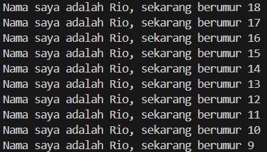

# Pemrograman Mobile - 

**Nama**        : Rio Tri Prayogo

**NIM**         : 2341720236
## 02 | Pengantar Bahasa Pemrograman Dart - Bagian 1

### Tugas Praktikum
**Soal 1** 
Modifikasilah kode pada baris 3 di VS Code atau Editor Code favorit Anda berikut ini agar mendapatkan keluaran (output) sesuai yang diminta!

Output yang diminta (Gantilah Fulan dengan nama Anda):

> 

**Soal 2** 
Mengapa sangat penting untuk memahami bahasa pemrograman Dart sebelum kita menggunakan framework Flutter ? Jelaskan!
> Karena Flutter sendiri merupakan sebuah framework yang dibangun sepenuhnya dengan bahasa Dart. Sehingga pada dasarnya jika tidak memahami Dart, maka akan sulit memahami cara Flutter bekerja karena setiap kode Flutter merupakan kode Dart.

**Soal 3** 
Rangkumlah materi dari codelab ini menjadi poin-poin penting yang dapat Anda gunakan untuk membantu proses pengembangan aplikasi mobile menggunakan framework Flutter.
> - Dart adalah bahasa untuk Flutter, berorientasi objek dan null-safe (cegah error null).
> - Variabel bisa dideklarasikan dengan tipe explisit (String, int) maupun implisit (var,final,const).
> - Null Safety: Gunakan ? untuk variabel yang boleh null, ! untuk paksa non-null (hati-hati), dan ?? untuk nilai default.
> - Struktur kontrol: if, for, while untuk logika dan perulangan.
> - Fungsi: Blok kode yang dapat dipanggil ulang. Gunakan parameter named ({}) yang umum dipakai di Flutter.

**Soal 4** 
Buatlah penjelasan dan contoh eksekusi kode tentang perbedaan Null Safety dan Late variabel !
> [Soal 4 Code](src/soal4.dart)
> - Null Safety adalah fitur yang memastikan bahwa secara default, variabel tidak boleh berisi nilai null. Ini mencegah error runtime yang umum terjadi (Null Reference Exceptions). Untuk membuat variabel yang boleh null, Anda harus secara eksplisit menambahkan tanda ? setelah tipe data.
> - Late variabel digunakan untuk variabel non-nullable yang nilainya akan diinisialisasi nanti, bukan saat deklarasi. Ini berguna ketika nilainya pasti akan diberikan sebelum digunakan, tetapi tidak bisa diberikan langsung saat deklarasi.