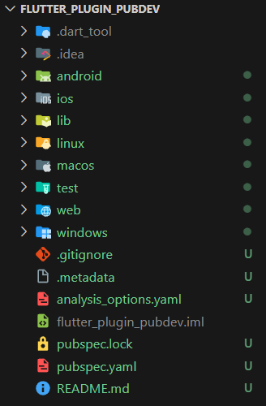
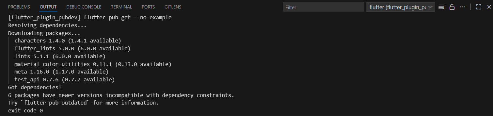
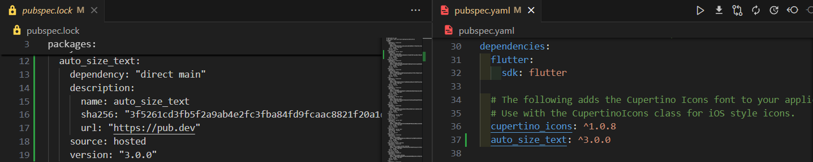
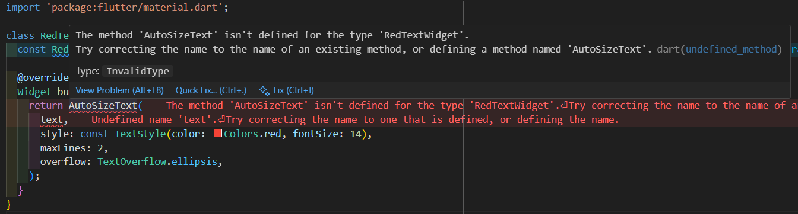
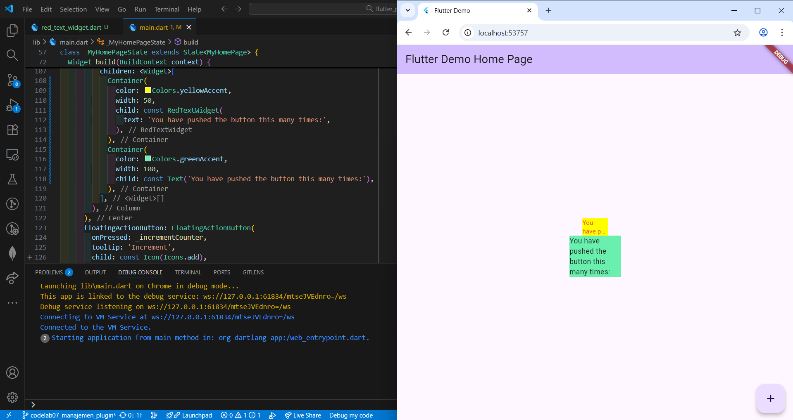

# Pemrograman Mobile

**Nama** : Rio Tri Prayogo

**NIM** : 2341720236

## 07 | Manajemen Plugin

### Praktikum

**Praktikum Menerapkan Plugin di Project Flutter**<br>
Langkah 1: Buat Project Baru
Buatlah sebuah project flutter baru dengan nama flutter_plugin_pubdev. Lalu jadikan repository di GitHub Anda dengan nama flutter_plugin_pubdev.
> <br><br>

Langkah 2: Menambahkan Plugin
Tambahkan plugin auto_size_text menggunakan perintah berikut di terminal
```
flutter pub add auto_size_text
```
Jika berhasil, maka akan tampil nama plugin beserta versinya di file pubspec.yaml pada bagian dependencies.
> <br><br>
> <br><br>

Langkah 3: Buat file red_text_widget.dart
Buat file baru bernama red_text_widget.dart di dalam folder lib lalu isi kode seperti berikut.
```
import 'package:flutter/material.dart';

class RedTextWidget extends StatelessWidget {
  const RedTextWidget({Key? key}) : super(key: key);

  @override
  Widget build(BuildContext context) {
    return Container();
  }
}
```
> <br><br>
> Kode tersebut error karena dua alasan utama: variabel text tidak didefinisikan sebagai parameter dalam class, dan widget AutoSizeText membutuhkan package tambahan yang belum diimport. Untuk memperbaikinya, kita perlu menambahkan parameter text dan mengimpor package auto_size_text atau menggantinya dengan widget Text bawaan Flutter. Untuk memperbaikinya bisa melakukan import package dan menginisiasi variabel Text yang nantinya kode akan menjadi:
> ```
> import 'package:flutter/material.dart';
> import 'package:auto_size_text/auto_size_text.dart'; // Import package
>
> class RedTextWidget extends StatelessWidget {
>   final String text; // Tambahkan parameter text
>   
>   const RedTextWidget({Key? key, required this.text}) : super(key: key);
> 
>   @override
>   Widget build(BuildContext context) {
>     return AutoSizeText(
>       text,
>       style: const TextStyle(color: Colors.red, fontSize: 14),
>       maxLines: 2,
>       overflow: TextOverflow.ellipsis,
>     );
>   }
> }
> ```

Langkah 4: Tambah Widget AutoSizeText
Masih di file red_text_widget.dart, untuk menggunakan plugin auto_size_text, ubahlah kode return Container() menjadi seperti berikut.
```
return AutoSizeText(
      text,
      style: const TextStyle(color: Colors.red, fontSize: 14),
      maxLines: 2,
      overflow: TextOverflow.ellipsis,
);
```
Setelah Anda menambahkan kode di atas, Anda akan mendapatkan info error. Mengapa demikian? Jelaskan dalam laporan praktikum Anda!

Langkah 5: Buat Variabel text dan parameter di constructor
Tambahkan variabel text dan parameter di constructor seperti berikut.
```
final String text;

const RedTextWidget({Key? key, required this.text}) : super(key: key);
```

Langkah 6: Tambahkan widget di main.dart
Buka file main.dart lalu tambahkan di dalam children: pada class _MyHomePageState
```
Container(
   color: Colors.yellowAccent,
   width: 50,
   child: const RedTextWidget(
             text: 'You have pushed the button this many times:',
          ),
),
Container(
    color: Colors.greenAccent,
    width: 100,
    child: const Text(
           'You have pushed the button this many times:',
          ),
),
```
Run aplikasi tersebut dengan tekan F5, maka hasilnya akan seperti berikut.
> <br><br>

### Tugas Praktikum
