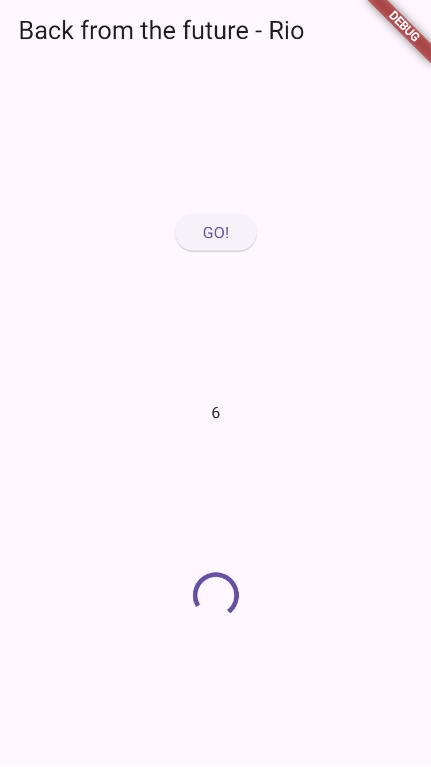
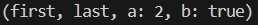
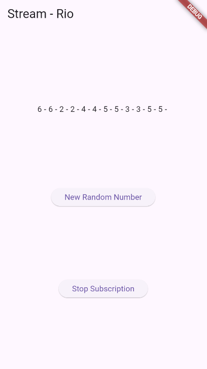
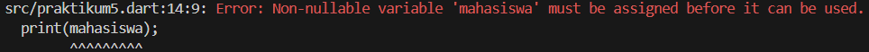
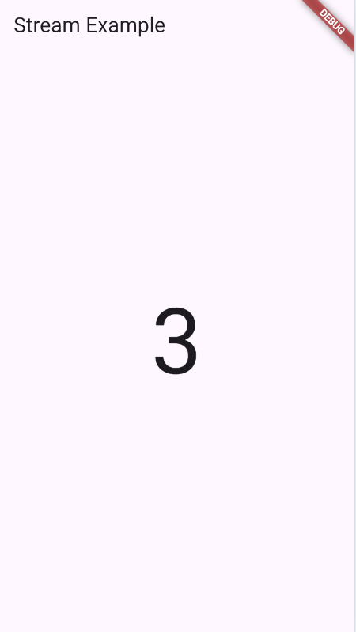
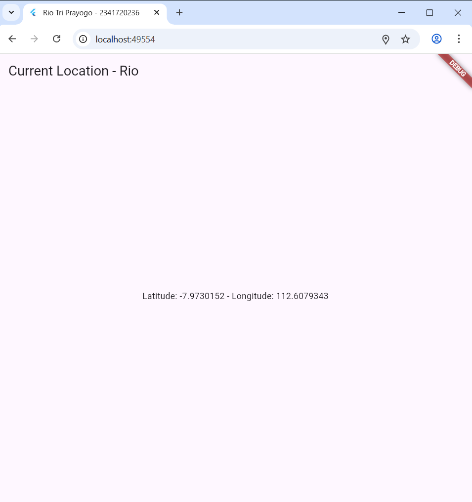

# Pemrograman Mobile

**Nama** : Rio Tri Prayogo

**NIM** : 2341720236

## 11 | Pemrograman Asynchronous

### Praktikum

**Praktikum 1: Mengunduh Data dari Web Service (API)**<br>

Langkah 1: Buat Project Baru

Buatlah sebuah project flutter baru dengan nama books di folder src week-11 repository GitHub Anda.

Kemudian Tambahkan dependensi http dengan mengetik perintah berikut di terminal.

```
flutter pub add http
```

Langkah 2: Cek file pubspec.yaml

Jika berhasil install plugin, pastikan plugin http telah ada di file pubspec ini seperti berikut.

```
dependencies:
  flutter:
    sdk: flutter
  http: ^1.1.0
```

Langkah 3: Buka file main.dart
Ketiklah kode seperti berikut ini.

> Soal 1
> Tambahkan nama panggilan Anda pada title app sebagai identitas hasil pekerjaan Anda.
>
> > `title: 'Rio Tri Prayogo - 2341720236',`

```
import 'dart:async';
import 'package:flutter/material.dart';
import 'package:http/http.dart';
import 'package:http/http.dart' as http;

void main() {
  runApp(const MyApp());
}

class MyApp extends StatelessWidget {
  const MyApp({super.key});

  @override
  Widget build(BuildContext context) {
    return MaterialApp(
      title: 'Flutter Demo',
      theme: ThemeData(
        primarySwatch: Colors.blue,
        visualDensity: VisualDensity.adaptivePlatformDensity,
      ),
      home: const FuturePage(),
    );
  }
}

class FuturePage extends StatefulWidget {
  const FuturePage({super.key});

  @override
  State<FuturePage> createState() => _FuturePageState();
}

class _FuturePageState extends State<FuturePage> {
  String result = '';
  @override
  Widget build(BuildContext context) {
    return Scaffold(
      appBar: AppBar(title: const Text('Back from the future')),
      body: Center(
        child: Column(
          children: [
            const Spacer(),
            ElevatedButton(child: const Text('GO!'), onPressed: () {}),
            const Spacer(),
            Text(result),
            const Spacer(),
            const CircularProgressIndicator(),
            const Spacer(),
          ],
        ),
      ),
    );
  }
}
```

Langkah 4: Tambah method getData()

Tambahkan method ini ke dalam class \_FuturePageState yang berguna untuk mengambil data dari API Google Books.

```
  Future<Response> fetchData() async {
    const authority = 'www.googleapis.com';
    const path = '/books/v1/volumes/junbDwAAQBAJ';
    Uri uri = Uri.https(authority, path);
    return http.get(uri);
  }
```

> Soal 2
>
> - Carilah judul buku favorit Anda di Google Books, lalu ganti ID buku pada variabel path di kode tersebut. Caranya ambil di URL browser Anda seperti gambar berikut ini.
> - Kemudian cobalah akses di browser URI tersebut dengan lengkap seperti ini. Jika menampilkan data JSON, maka Anda telah berhasil. Lakukan capture milik Anda dan tulis di README pada laporan praktikum. Lalu lakukan commit dengan pesan "W11: Soal 2".
>   > <br><br>

Langkah 5: Tambah kode di ElevatedButton

Tambahkan kode pada onPressed di ElevatedButton seperti berikut.

```
            ElevatedButton(
              child: const Text('GO!'),
              onPressed: () {
                setState(() {});
                fetchData()
                    .then((value) {
                      result = value.body.toString().substring(0, 450);
                      setState(() {});
                    })
                    .catchError((_) {
                      result = 'Error occured';
                      setState(() {});
                    });
              },
            ),
```

> Soal 3
>
> - Jelaskan maksud kode langkah 5 tersebut terkait substring dan catchError!
> - Capture hasil praktikum Anda berupa GIF dan lampirkan di README. Lalu lakukan commit dengan pesan "W11: Soal 3".
>   > answer

> <br><br>

**Praktikum 2: Menggunakan await/async untuk menghindari callbacks**<br>

Langkah 1: Buka file main.dart

Tambahkan tiga method berisi kode seperti berikut di dalam class \_FuturePageState.

```
Future<int> returnOneAsync() async {
  await Future.delayed(const Duration(seconds: 3));
  return 1;
}

Future<int> returnTwoAsync() async {
  await Future.delayed(const Duration(seconds: 3));
  return 2;
}

Future<int> returnThreeAsync() async {
  await Future.delayed(const Duration(seconds: 3));
  return 3;
}
```

Langkah 2: Tambah method count()

Lalu tambahkan lagi method ini di bawah ketiga method sebelumnya.

```
  Future count() async {
    int total = 0;
    total = await returnOneAsync();
    total += await returnTwoAsync();
    total += await returnThreeAsync();
    setState(() {
      result = total.toString();
    });
  }
```

Langkah 3: Panggil count()

Lakukan comment kode sebelumnya, ubah isi kode onPressed() menjadi seperti berikut.

```

```

Langkah 4: Run

Akhirnya, run atau tekan F5 jika aplikasi belum running. Maka Anda akan melihat seperti gambar berikut, hasil angka 6 akan tampil setelah delay 9 detik.

> <br><br>

**Praktikum 3: Menggunakan Completer di Future**<br>

Langkah 1: Buka main.dart

Pastikan telah impor package async berikut.

```
import 'package:async/async.dart';
```

Langkah 2: Tambahkan variabel dan method

Tambahkan variabel late dan method di class \_FuturePageState seperti ini.

```
late Completer completer;

Future getNumber() {
  completer = Completer<int>();
  calculate();
  return completer.future;
}

Future calculate() async {
  await Future.delayed(const Duration(seconds : 5));
  completer.complete(42);
}
```

Langkah 3: Ganti isi kode onPressed()

Tambahkan kode berikut pada fungsi onPressed(). Kode sebelumnya bisa Anda comment.

```
                getNumber().then((value) {
                  setState(() {
                    result = value.toString();
                  });
                });
```

Langkah 4:

Terakhir, run atau tekan F5 untuk melihat hasilnya jika memang belum running. Bisa juga lakukan hot restart jika aplikasi sudah running. Maka hasilnya akan seperti gambar berikut ini. Setelah 5 detik, maka angka 42 akan tampil.

> <br><br>

> Soal 5
>
> - Jelaskan maksud kode langkah 2 tersebut!
> - Capture hasil praktikum Anda berupa GIF dan lampirkan di README. Lalu lakukan commit dengan pesan "W11: Soal 5".
>   > answer

Langkah 5: Ganti method calculate()

Gantilah isi code method calculate() seperti kode berikut, atau Anda dapat membuat calculate2()

```
  Future calculate() async {
    try {
      await Future.delayed(const Duration(seconds: 5));
      completer.complete(42);
    } catch (_) {
      completer.completeError({});
    }
  }
```

Langkah 6: Pindah ke onPressed()

Ganti menjadi kode seperti berikut.

```
getNumber().then((value) {
  setState(() {
    result = value.toString();
  });
}).catchError((e) {
  result = 'An error occurred';
});
```

> Soal 6
>
> - Jelaskan maksud perbedaan kode langkah 2 dengan langkah 5-6 tersebut!
> - Capture hasil praktikum Anda berupa GIF dan lampirkan di README. Lalu lakukan commit dengan pesan "W11: Soal 6".
>   > answer

**Praktikum 4: Memanggil Future secara paralel**<br>

Langkah 1: Buka file main.dart

Tambahkan method ini ke dalam class \_FuturePageState

```
  void returnFG() {
    FutureGroup<int> futureGroup = FutureGroup<int>();
    futureGroup.add(returnOneAsync());
    futureGroup.add(returnTwoAsync());
    futureGroup.add(returnThreeAsync());
    futureGroup.close();
    futureGroup.future.then((List<int> value) {
      int total = 0;
      for (var element in value) {
        total += element;
      }
      setState(() {
        result = total.toString();
      });
    });
  }
```

Langkah 2: Edit onPressed()

Anda bisa hapus atau comment kode sebelumnya, kemudian panggil method dari langkah 1 tersebut.

```
onPressed: () {
    returnFG();
}
```

Langkah 3: Run
Anda akan melihat hasilnya dalam 3 detik berupa angka 6 lebih cepat dibandingkan praktikum sebelumnya menunggu sampai 9 detik.

> <br><br>

> Soal 7
>
> - Capture hasil praktikum Anda berupa GIF dan lampirkan di README. Lalu lakukan commit dengan pesan "W11: Soal 7".
>   > answer

Langkah 4: Ganti variabel futureGroup

Anda dapat menggunakan FutureGroup dengan Future.wait seperti kode berikut.

```
final futures = Future.wait<int>([
  returnOneAsync(),
  returnTwoAsync(),
  returnThreeAsync(),
]);
```

> <br><br>

> Soal 8
>
> - Jelaskan maksud perbedaan kode langkah 1 dan 4!
>   > answer

**Praktikum 5: Menangani Respon Error pada Async Code**<br>

Langkah 1: Buka file main.dart

Tambahkan method ini ke dalam class \_FuturePageState

```
  Future returnError() async {
    await Future.delayed(const Duration(seconds: 2));
    throw Exception('Something terrible happened!');
  }
```

Langkah 2: ElevatedButton

Ganti dengan kode berikut

```
returnError()
    .then((value) {
      setState(() {
        result = 'Success';
      });
    })
    .catchError((onError) {
      setState(() {
        result = onError.toString();
      });
    })
    .whenComplete(() => print('Complete'));
```

Langkah 3: Run

Lakukan run dan klik tombol GO! maka akan menghasilkan seperti gambar berikut.

> <br><br>

Pada bagian debug console akan melihat teks Complete seperti berikut.

> <br><br>

> Soal 9
>
> - Capture hasil praktikum Anda berupa GIF dan lampirkan di README. Lalu lakukan commit dengan pesan "W11: Soal 9".
>   > answer

Langkah 4: Tambah method handleError()

Tambahkan kode ini di dalam class \_FutureStatePage

```
  Future handleError() async {
    try {
      await returnError();
    } catch (error) {
      setState(() {
        result = error.toString();
      });
    } finally {
      print('Complete');
    }
  }
```

> Soal 10
>
> - Panggil method handleError() tersebut di ElevatedButton, lalu run. Apa hasilnya? Jelaskan perbedaan kode langkah 1 dan 4!
>   > <br><br>

**Praktikum 6: Menggunakan Future dengan StatefulWidget**<br>

Langkah 1: install plugin geolocator

Tambahkan plugin geolocator dengan mengetik perintah berikut di terminal.

```
flutter pub add geolocator
```

> <br><br>

Langkah 2: Tambah permission GPS

Jika Anda menargetkan untuk platform Android, maka tambahkan baris kode berikut di file android/app/src/main/androidmanifest.xml

```
<uses-permission android:name="android.permission.ACCESS_FINE_LOCATION"/>
<uses-permission android:name="android.permission.ACCESS_COARSE_LOCATION"/>
```

Jika Anda menargetkan untuk platform iOS, maka tambahkan kode ini ke file Info.plist

```
<key>NSLocationWhenInUseUsageDescription</key>
<string>This app needs to access your location</string>
```

Langkah 3: Buat file geolocation.dart

Tambahkan file baru ini di folder lib project Anda.

Langkah 4: Buat StatefulWidget

Buat class LocationScreen di dalam file geolocation.dart

Langkah 5: Isi kode geolocation.dart

```
import 'package:flutter/material.dart';
import 'package:geolocator/geolocator.dart';

class LocationScreen extends StatefulWidget {
  const LocationScreen({super.key});

  @override
  State<LocationScreen> createState() => _LocationScreenState();
}

class _LocationScreenState extends State<LocationScreen> {
  String myPosition = '';
  @override
  void initState() {
    super.initState();
    getPosition().then((Position myPos) {
      myPosition =
          'Latitude: ${myPos.latitude.toString()} - Longitude: ${myPos.longitude.toString()}';
      setState(() {});
      myPosition = myPosition;
    });
  }

  @override
  Widget build(BuildContext context) {
    return Scaffold(
      appBar: AppBar(title: const Text('Current Location - Rio')),
      body: Center(child: Text(myPosition)),
    );
  }

  Future<Position> getPosition() async {
    await Geolocator.requestPermission();
    await Geolocator.isLocationServiceEnabled();
    Position? position = await Geolocator.getCurrentPosition();
    return position;
  }
}
```

> Soal 11
>
> - Tambahkan nama panggilan Anda pada tiap properti title sebagai identitas pekerjaan Anda.
>   > `appBar: AppBar(title: const Text('Current Location - Rio')),`

Langkah 6: Edit main.dart

Panggil screen baru tersebut di file main Anda seperti berikut.

```
home: LocationScreen(),
```

Langkah 7: Run

Run project Anda di device atau emulator (bukan browser), maka akan tampil seperti berikut ini.

> <br><br>

Langkah 8: Tambahkan animasi loading

Tambahkan widget loading seperti kode berikut. Lalu hot restart, perhatikan perubahannya.

```
  @override
  Widget build(BuildContext context) {
    final myWidget = myPosition == ''
        ? const CircularProgressIndicator()
        : Text(myPosition);

    return Scaffold(
      appBar: AppBar(title: const Text('Current Location - Rio')),
      body: Center(child: myWidget),
    );
  }
```

> <br><br>

> Soal 12
>
> - Jika Anda tidak melihat animasi loading tampil, kemungkinan itu berjalan sangat cepat. Tambahkan delay pada method getPosition() dengan kode await Future.delayed(const Duration(seconds: 3));
>   > <br><br>
> - Apakah Anda mendapatkan koordinat GPS ketika run di browser? Mengapa demikian?
>   > <br><br>
>   > answer
> - Capture hasil praktikum Anda berupa GIF dan lampirkan di README. Lalu lakukan commit dengan pesan "W11: Soal 12".
> > answer


