# Pemrograman Mobile

**Nama** : Rio Tri Prayogo

**NIM** : 2341720236

## 04 | Pengantar Bahasa Pemrograman Dart - Bagian 3

### Praktikum

**Praktikum 1: Eksperimen Tipe Data List**<br>
Langkah 1:
Ketik atau salin kode program berikut ke dalam void main().

```
var list = [1, 2, 3];
assert(list.length == 3);
assert(list[1] == 2);
print(list.length);
print(list[1]);

list[1] = 1;
assert(list[1] == 1);
print(list[1]);
```

Langkah 2:
Silakan coba eksekusi (Run) kode pada langkah 1 tersebut. Apa yang terjadi? Jelaskan!

> Kode tersebut merupakan penggunaan list dalam dart yang mana pada awalnya list diinisiasi. Lalu assert memverifikasi bahwa panjang list adalah 3 dan elemen pada indeks ke-1 adalah 2, yang kemudian dicetak (3, 2). Selanjutnya, nilai pada indeks ke-1 diubah dari 2 menjadi 1. Perubahan ini divalidasi oleh assert sebelum nilai barunya dicetak (1). Sehingga akan muncul output: <br><br>

Langkah 3:
Ubah kode pada langkah 1 menjadi variabel final yang mempunyai index = 5 dengan default value = null. Isilah nama dan NIM Anda pada elemen index ke-1 dan ke-2. Lalu print dan capture hasilnya.

> ```
>  final List<String?> list = List.filled(5, null);
>
>  list[1] = "Rio Tri Prayogo";
>  list[2] = "2341720236";
>
>  print(list);
>  print("Index 1: ${list[1]}");
>  print("Index 2: ${list[2]}");
> ```
>
> Apa yang terjadi ? Jika terjadi error, silakan perbaiki.
> Kode tersebut melakukan inisiasi dengan variabel final yang berisi 5 index dan memiliki default null, lalu pada index 1 diisi nama dan index 2 diisi NIM dan dicetak sehingga akan memunculkan output: <br><br>

**_[Praktikum 1 Code](src/praktikum1.dart)_**

**Praktikum 2: Eksperimen Tipe Data Set**<br>
Langkah 1:
Ketik atau salin kode program berikut ke dalam fungsi main().

```
var halogens = {'fluorine', 'chlorine', 'bromine', 'iodine', 'astatine'};
print(halogens);
```

Langkah 2:
Silakan coba eksekusi (Run) kode pada langkah 1 tersebut. Apa yang terjadi? Jelaskan! Lalu perbaiki jika terjadi error.

> Kode tersebut merupakan penggunaan Set berisi lima elemen string berupa nama-nama unsur halogen, lalu dicetak menggunakan print() sehingga muncul output:<br><br>

Langkah 3:
Tambahkan kode program berikut, lalu coba eksekusi (Run) kode Anda.

```
var names1 = <String>{};
Set<String> names2 = {}; // This works, too.
var names3 = {}; // Creates a map, not a set.

print(names1);
print(names2);
print(names3);
```

Apa yang terjadi ? Jika terjadi error, silakan perbaiki namun tetap menggunakan ketiga variabel tersebut. Tambahkan elemen nama dan NIM Anda pada kedua variabel Set tersebut dengan dua fungsi berbeda yaitu .add() dan .addAll(). Untuk variabel Map dihapus, nanti kita coba di praktikum selanjutnya.

> Kode tersebut menunjukkan tiga cara mendeklarasikan koleksi dalam Dart dengan hasil yang berbeda. Deklarasi pertama var names1 = {} dan kedua Set names2 = {} sama-sama membuat Set string kosong, yang merupakan kumpulan elemen unik tanpa urutan tertentu. Sedangkan deklarasi ketiga var names3 = {} justru membuat Map kosong, karena tanpa annotasi tipe eksplisit, Dart menganggap kurung kurawal sebagai pembentuk Map. Ketika dicetak, names1 dan names2 akan menampilkan set kosong {}, sementara names3 akan menampilkan map kosong {} yang secara internal merupakan struktur data berbeda meski tampilan outputnya sama yaitu:<br><br>
> Untuk penambahan elemen NIM dan nama dengan fungsi .add() dan .addAll() dengan kode
> ```
>  names1.add('Rio Tri Prayogo'); 
>  names1.add('2341720236');
>
>  names2.addAll([
>    'Rio Tri Prayogo',
>    '2341720236',
>  ]);
>
>  print(names1);
>  print(names2);
> ```
> Dengan output:<br>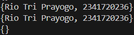<br>
> Untuk Map bisa menggunakan kode:
> ```
>  names3['nama'] = 'Rio Tri Prayogo';
>  names3['nim'] = '2341720236';
>
>  print(names3);
> ```
> Dengan output:<br>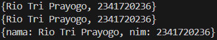<br>

**_[Praktikum 2 Code](src/praktikum2.dart)_**

**Praktikum 3: Eksperimen Tipe Data Maps**<br>
Langkah 1:
Ketik atau salin kode program berikut ke dalam fungsi main().

```
var gifts = {
  // Key:    Value
  'first': 'partridge',
  'second': 'turtledoves',
  'fifth': 1
};

var nobleGases = {
  2: 'helium',
  10: 'neon',
  18: 2,
};

print(gifts);
print(nobleGases);
```

Langkah 2:
Silakan coba eksekusi (Run) kode pada langkah 1 tersebut. Apa yang terjadi? Jelaskan! Lalu perbaiki jika terjadi error.

> Kode tersebut mendemonstrasikan pembuatan Map dalam Dart dengan tipe data yang dinamis. Variabel gifts merupakan Map yang menggunakan key string dengan value campuran string dan integer, sedangkan nobleGases menggunakan key integer dengan value yang juga campuran string dan integer. Ketika dicetak, kedua Map tersebut akan menampilkan seluruh pasangan key-value yang dimilikinya yaitu:<br><br>

Langkah 3:
Tambahkan kode program berikut, lalu coba eksekusi (Run) kode Anda.

```
var mhs1 = Map<String, String>();
gifts['first'] = 'partridge';
gifts['second'] = 'turtledoves';
gifts['fifth'] = 'golden rings';

var mhs2 = Map<int, String>();
nobleGases[2] = 'helium';
nobleGases[10] = 'neon';
nobleGases[18] = 'argon';
```

Apa yang terjadi ? Jika terjadi error, silakan perbaiki.

> Kode diatas menunjukkan dua cara inisialisasi Map dalam Dart. Pertama, mhs1 diinisialisasi sebagai Map<String, String>() dan diisi dengan tiga pasangan key-value string. Kedua, mhs2 diinisialisasi sebagai Map<int, String>() dan diisi dengan pasangan key integer dan value string yang akhirnya menunjukkan output:<br>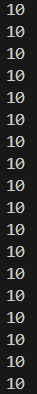<br>

Tambahkan elemen nama dan NIM Anda pada tiap variabel di atas (gifts, nobleGases, mhs1, dan mhs2). Dokumentasikan hasilnya dan buat laporannya!

> Menambahkan elemen nama dan NIM Anda pada tiap variabel dengan kode dalam: **_[Praktikum 3 Code](src/praktikum3.dart)_** dengan output:<br>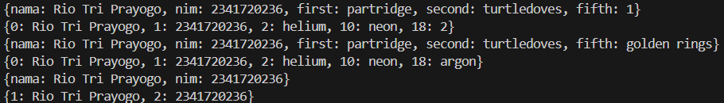<br>

**_[Praktikum 3 Code](src/praktikum3.dart)_**

**Praktikum 4: Eksperimen Tipe Data List: Spread dan Control-flow Operators**<br>
Langkah 1:
Ketik atau salin kode program berikut ke dalam fungsi main().

```
var list = [1, 2, 3];
var list2 = [0, ...list];
print(list1);
print(list2);
print(list2.length);
```

Langkah 2:
Silakan coba eksekusi (Run) kode pada langkah 1 tersebut. Apa yang terjadi? Jelaskan! Lalu perbaiki jika terjadi error.

> Kode tersebut menunjukkan penggunaan spread operator (...) dalam Dart untuk menggabungkan list. Variabel list berisi [1, 2, 3] dan list2 dibuat dengan menggabungkan elemen 0 dengan semua elemen dari list menggunakan spread operator, sehingga menghasilkan [0, 1, 2, 3]. Namun terdapat kesalahan karena kode mencoba mencetak list1 yang tidak dideklarasikan, seharusnya list dengan output error:<br><br>. Untuk memperbaikinya dengan mengubah list1 menjadi list sehingga memunculkan output:<br><br>

Langkah 3:
Tambahkan kode program berikut, lalu coba eksekusi (Run) kode Anda.

```
list1 = [1, 2, null];
print(list1);
var list3 = [0, ...?list1];
print(list3.length);
```

Apa yang terjadi ? Jika terjadi error, silakan perbaiki.

> Kode tersebut mendemonstrasikan penggunaan null-aware spread operator (...?) dalam Dart. Variabel list1 diinisialisasi dengan elemen [1, 2, null] yang mengandung nilai null. Kemudian list3 dibuat dengan menggabungkan elemen 0 dan elemen-elemen dari list1 menggunakan operator ...? yang aman terhadap null - jika list1 bernilai null, operator ini tidak akan menyebabkan error tetapi hanya akan diabaikan. Output yang dihasilkan adalah list3 akan berisi [0, 1, 2, null] dengan panjang 4, karena operator ...? tetap memasukkan elemen null dari list1. Kode tersebut akan menghasilkan error karena variabel list1 tidak dideklarasikan dengan kata kunci var, final, atau const sebelum penggunaannya dengan output error:<br>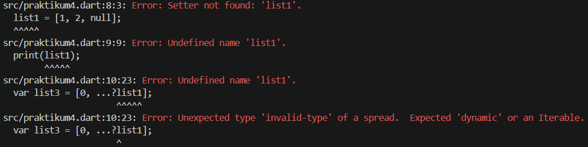<br>Dengan penambahan var pada list1 maka akan muncul output:<br>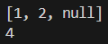<br>

Tambahkan variabel list berisi NIM Anda menggunakan Spread Operators. Dokumentasikan hasilnya dan buat laporannya!
> Menambahkan variabel list berisi nama NIM menggunakan Spread Operators dengan kode:
> ```
>  var bio = ['Rio Tri Prayogo', 2341720236];
>  print(bio);
>  var list4 = [...bio];
>  print(list4);
> ```
> Sehingga memunculkan output:<br>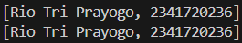<br>

Langkah 4:
Tambahkan kode program berikut, lalu coba eksekusi (Run) kode Anda.

```
var nav = ['Home', 'Furniture', 'Plants', if (promoActive) 'Outlet'];
print(nav);
```

Apa yang terjadi ? Jika terjadi error, silakan perbaiki. Tunjukkan hasilnya jika variabel promoActive ketika true dan false.

> Kode tersebut mendemonstrasikan penggunaan collection if dalam Dart untuk menambahkan elemen ke dalam list secara kondisional. Variabel nav diinisialisasi dengan tiga elemen string tetap: 'Home', 'Furniture', dan 'Plants'. Elemen keempat 'Outlet' hanya akan ditambahkan ke dalam list jika variabel promoActive bernilai true. Namun, kode ini akan menghasilkan error karena variabel promoActive tidak dideklarasikan sebelumnya dengan output:<br>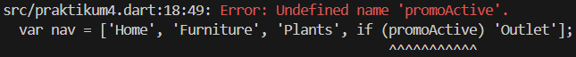<br>Untuk memperbaikinya bisa menambahkan '=true'/'=false' var promoActive sehingga muncul output<br>Jika true:<br>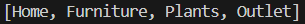<br>Jika false:<br>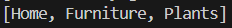<br>

Langkah 5:
Tambahkan kode program berikut, lalu coba eksekusi (Run) kode Anda.

```
var nav2 = ['Home', 'Furniture', 'Plants', if (login case 'Manager') 'Inventory'];
print(nav2);
```

Apa yang terjadi ? Jika terjadi error, silakan perbaiki. Tunjukkan hasilnya jika variabel login mempunyai kondisi lain.

> Kode tersebut mendemonstrasikan penggunaan collection if dengan pattern matching dalam Dart. Variabel nav2 diinisialisasi dengan tiga elemen string tetap: 'Home', 'Furniture', dan 'Plants'. Elemen keempat 'Inventory' hanya akan ditambahkan ke dalam list jika variabel login sama dengan string 'Manager' menggunakan pattern matching dengan kata kunci case. Namun, kode ini akan menghasilkan error karena variabel login tidak dideklarasikan sebelumnya dengan output:<br>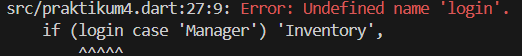<br>Untuk memperbaikinya bisa inisiasi variabel login berupa<br>Jika Manager:<br>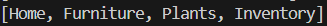<br>Jika bukan Manager<br>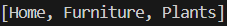<br>

Langkah 6:
Tambahkan kode program berikut, lalu coba eksekusi (Run) kode Anda.

```
var listOfInts = [1, 2, 3];
var listOfStrings = ['#0', for (var i in listOfInts) '#$i'];
assert(listOfStrings[1] == '#1');
print(listOfStrings);
```

Apa yang terjadi ? Jika terjadi error, silakan perbaiki. Jelaskan manfaat Collection For dan dokumentasikan hasilnya.

> Kode tersebut mendemonstrasikan penggunaan collection for dalam Dart untuk membuat list baru berdasarkan list existing. Variabel listOfInts berisi [1, 2, 3] dan listOfStrings dibuat dengan elemen pertama '#0' diikuti oleh elemen-elemen yang di-generate dari loop for (var i in listOfInts) '#$i' yang menghasilkan string '#1', '#2', '#3'. Pernyataan assert memverifikasi bahwa elemen indeks 1 memang '#1'. Output yang dihasilkan:<br>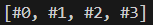<br>

**_[Praktikum 4 Code](src/praktikum4.dart)_**

**Praktikum 5: Eksperimen Tipe Data Records**<br>
Langkah 1:
Ketik atau salin kode program berikut ke dalam fungsi main().

```
var record = ('first', a: 2, b: true, 'last');
print(record)
```

Langkah 2:
Silakan coba eksekusi (Run) kode pada langkah 1 tersebut. Apa yang terjadi? Jelaskan! Lalu perbaiki jika terjadi error.

> Kode tersebut mendemonstrasikan pembuatan record dalam Dart yang dapat menampung elemen posisional dan named. Record ini berisi empat elemen: dua elemen posisional ('first' dan 'last') dan dua elemen named (a: 2 dan b: true). Ketika dicetak, outputnya akan menampilkan struktur record lengkap dengan semua elemennya seperti:<br><br>

Langkah 3:
Tambahkan kode program berikut di luar scope void main(), lalu coba eksekusi (Run) kode Anda.

```
(int, int) tukar((int, int) record) {
  var (a, b) = record;
  return (b, a);
}
```

Apa yang terjadi ? Jika terjadi error, silakan perbaiki. Gunakan fungsi tukar() di dalam main() sehingga tampak jelas proses pertukaran value field di dalam Records.

> Kode tersebut mendefinisikan fungsi tukar di luar scope main() yang menerima parameter berupa record (int, int) dan mengembalikan record dengan posisi nilai yang ditukar. Fungsi ini menggunakan destructuring untuk mengambil nilai a dan b dari record input, kemudian mengembalikan record baru (b, a) yang menukar posisi kedua nilai tersebut. Untuk mengeksekusi fungsi ini, perlu dipanggil dari dalam main() dengan memberikan record berisi dua integer sebagai argumen dengan kode:
> ```
>   print(tukar((1, 2)));
> ```
> Sehingga muncul output:<br><br>

Langkah 4:
Tambahkan kode program berikut di dalam scope void main(), lalu coba eksekusi (Run) kode Anda.

```
// Record type annotation in a variable declaration:
(String, int) mahasiswa;
print(mahasiswa);
```

Apa yang terjadi ? Jika terjadi error, silakan perbaiki. Inisialisasi field nama dan NIM Anda pada variabel record mahasiswa di atas. Dokumentasikan hasilnya dan buat laporannya!

> Kode tersebut mendeklarasikan variabel mahasiswa sebagai record dengan tipe (String, int) yang terdiri dari string dan integer. Namun, kode ini akan menghasilkan error karena variabel mahasiswa tidak diinisialisasi dengan nilai dan record tidak boleh bernilai null secara default dengan output error:<br><br>Untuk memperbaikinya, perlu memberikan nilai inisialisasi yang mana disini menggunakan nama NIM:
> ```
> (String, int) mahasiswa = ('Rio Tri Prayogo', 2341720236);
> ```
> Sehingga muncul output:<br>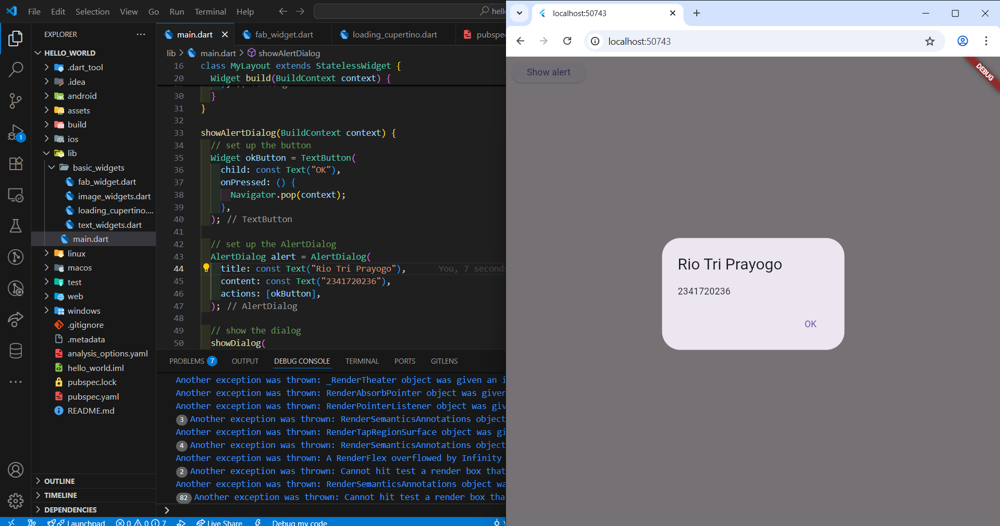<br>

Langkah 5:
Tambahkan kode program berikut di dalam scope void main(), lalu coba eksekusi (Run) kode Anda.

```
var mahasiswa2 = ('first', a: 2, b: true, 'last');

print(mahasiswa2.$1); // Prints 'first'
print(mahasiswa2.a); // Prints 2
print(mahasiswa2.b); // Prints true
print(mahasiswa2.$2); // Prints 'last'
```

Apa yang terjadi ? Jika terjadi error, silakan perbaiki.

> Kode tersebut mendemonstrasikan cara mengakses elemen-elemen dalam record di Dart. Variabel mahasiswa2 adalah record yang berisi empat elemen: dua elemen posisional ('first' dan 'last') dan dua elemen named (a: 2 dan b: true). Untuk mengakses elemen posisional digunakan notasi $ diikuti nomor urut ($1, $2), sedangkan untuk elemen named digunakan notasi titik langsung dengan nama elemen (.a, .b). Output yang dihasilkan:<br>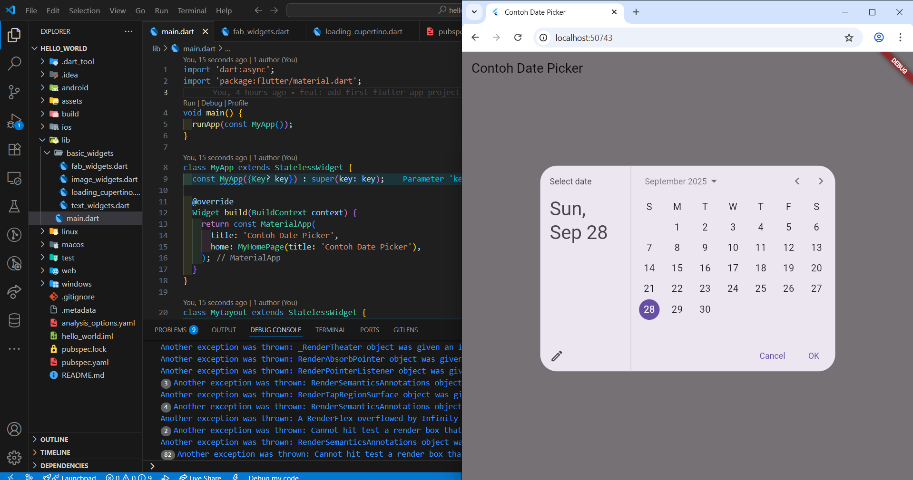<br>

Gantilah salah satu isi record dengan nama dan NIM Anda, lalu dokumentasikan hasilnya dan buat laporannya!

> Untuk mengganti isi record dengan nama nim bisa menggunakan kode:
> ```
>   var mahasiswa2 = ('Rio Tri Prayogo', a: 2341720236, b: true, 'last');
> ```
> Sehingga jika di print akan menjadi:<br>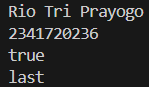<br>

**_[Praktikum 5 Code](src/praktikum5.dart)_**

**Tugas Praktikum**<br>
1. Silakan selesaikan Praktikum 1 sampai 5, lalu dokumentasikan berupa screenshot hasil pekerjaan Anda beserta penjelasannya!
2. Jelaskan yang dimaksud Functions dalam bahasa Dart!
> Functions dalam Dart adalah blok kode yang dapat dipanggil berulang kali untuk melakukan tugas tertentu. Mereka dapat menerima parameter, mengembalikan nilai, dan membantu dalam organisasi kode.
3. Jelaskan jenis-jenis parameter di Functions beserta contoh sintaksnya!
> Ada 4 jenis parameter dalam Dart yaitu:
> 1. Required Positional: Parameter wajib sesuai urutan
> ```
> void greet(String name, int age) {...}
> ```
> 2. Optional Positional: Parameter opsional dalam kurung siku
> ```
> void greet(String name, [int? age]) {...}
> ```
> 3. Named Parameters: Parameter dengan nama spesifik dalam kurung kurawal
> ```
> void greet({required String name, int? age}) {...}
> ```
> 4. Default Parameters: Nilai default jika tidak diberikan
> ```
> void greet(String name, {int age = 18}) {...}
> ```
4. Jelaskan maksud Functions sebagai first-class objects beserta contoh sintaknya!
> Functions dapat diperlakukan seperti objek biasa yang mana dapat disimpan dalam variabel, dikirim sebagai parameter, atau dikembalikan dari function lain. Contoh:
> ```
> // Function disimpan dalam variabel
> var penjumlahan = (int a, int b) => a + b;
>
> // Function sebagai parameter
> void hitung(int a, int b, Function operasi) {
>   print(operasi(a, b));
> }
> 
> // Function mengembalikan function
> Function multiplier(int factor) {
>   return (int value) => value * factor;
> }
> 
> void main() {
>   hitung(5, 3, penjumlahan); // Output: 8
>   
>   var kaliDua = multiplier(2);
>   print(kaliDua(5)); // Output: 10
> }
> ```
5. Apa itu Anonymous Functions? Jelaskan dan berikan contohnya!
> Anonymous functions adalah function tanpa nama, biasanya digunakan untuk callback atau operasi sederhana. Contohnya:
> ```
> void main() {
>   var list = [1, 2, 3];
>   
>   // Anonymous function dengan forEach
>   list.forEach((item) {
>     print(item * 2);
>   });
>   
>   // Arrow syntax untuk single expression
>   var doubled = list.map((item) => item * 2);
>   print(doubled); // Output: (2, 4, 6)
> }
> ```
6. Jelaskan perbedaan Lexical scope dan Lexical closures! Berikan contohnya!
> Lexical Scope<br>
> Variable dapat diakses dalam scope di mana mereka dideklarasikan.
> ```
> void main() {
>   var x = 10;
>   
>   void innerFunction() {
>     var y = 20;
>     print(x); // Bisa mengakses x dari outer scope
>   }
>   
>   innerFunction();
>   // print(y); // Error: y tidak bisa diakses di sini
> }
> ```
> Lexical Closures<br>
> Function yang mengingat environment di mana mereka dibuat, bahkan setelah scope outer-nya selesai.
> ```
> Function makeCounter() {
>   var count = 0;
>   return () {
>     count++;
>     return count;
>   };
> }
>
> void main() {
>   var counter = makeCounter();
>   print(counter()); // Output: 1
>   print(counter()); // Output: 2
>   print(counter()); // Output: 3
>   // Variable 'count' tetap diingat meskipun makeCounter() sudah selesai
> }
> ```
7. Jelaskan dengan contoh cara membuat return multiple value di Functions!
> Dart tidak mendukung multiple return value langsung, tetapi dapat menggunakan:
> List:Untuk ordered collection dengan index
> ```
> List getData() => ["Rio", 2341720236, true];
> 
> var data = getData();
> print(data[0]); // "Rio"
> print(data[1]); // 2341720236
> ```
> Set: Untuk kumpulan value unik
> ```
> Set getData() => ["Rio", 2341720236, true];
> 
> var data = getData();
> print(data.first); // "Rio"
> print(data.contains(2341720236)); // true
> ```
> Map: Untuk data dengan key-value pairs
> ```
> Map getData() => {'name': 'Rio', 'nim': 2341720236};
> 
> var data = getData();
> print(data['nama']); // "Rio"
> print(data['nim']); // 2341720236
> ```
> Record: Untuk return value yang fixed structure
> ```
> (String, int, bool) getData() => ("Rio", 2341720236, true);
> 
> var (name, nim, isActive) = getData();;
> print(nama); // "Rio"
> print(nim); // 2341720236
> print(isActive); // true
> ```

Kumpulkan berupa link commit repo GitHub kepada dosen pengampu sesuai kesepakatan di kelas!