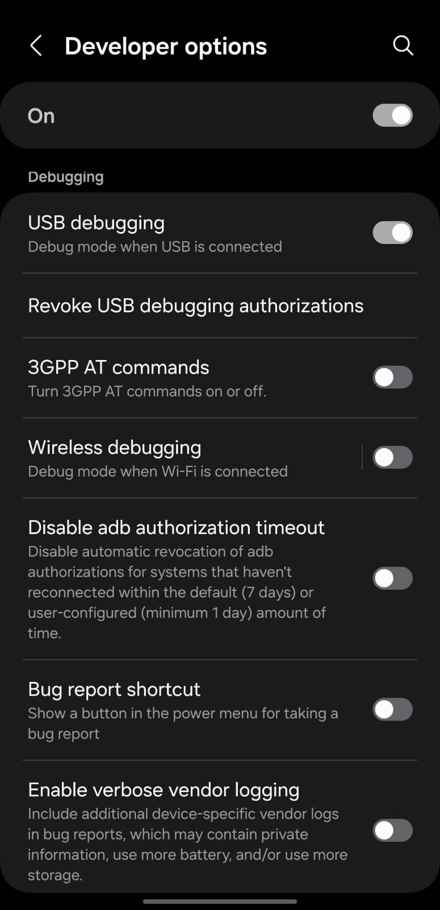

# Pemrograman Mobile

**Nama** : Rio Tri Prayogo

**NIM** : 2341720236

## 05 | Aplikasi Pertama dan Widget Dasar Flutter

### Praktikum

**Praktikum 1: Membuat Project Flutter Baru**<br>
Langkah 1:
Buka VS Code, lalu tekan tombol Ctrl + Shift + P maka akan tampil Command Palette, lalu ketik Flutter. Pilih New Application Project.

> <br><br>

Langkah 2:
Kemudian buat folder sesuai style laporan praktikum yang Anda pilih. Disarankan pada folder dokumen atau desktop atau alamat folder lain yang tidak terlalu dalam atau panjang. Lalu pilih Select a folder to create the project in.

> <br><br>

Langkah 3:
Buat nama project flutter hello_world seperti berikut, lalu tekan Enter. Tunggu hingga proses pembuatan project baru selesai.

> <br><br>

Langkah 4:
Jika sudah selesai proses pembuatan project baru, pastikan tampilan seperti berikut. Pesan akan tampil berupa "Your Flutter Project is ready!" artinya Anda telah berhasil membuat project Flutter baru.

> <br><br>

**Praktikum 2: Menghubungkan Perangkat Android atau Emulator**<br>
Melanjutkan dari praktikum 1, Anda diminta untuk menjalankan aplikasi ke perangkat fisik (device Android atau iOS). Silakan ikuti langkah-langkah pada codelab tautan berikut ini.

https://developer.android.com/codelabs/basic-android-kotlin-compose-connect-device?hl=id#0

> <br><br><br><br>

**Praktikum 3: Membuat Repository GitHub dan Laporan Praktikum**<br>
Membuat Github:
https://github.com/riotrip/mobile-smt5/tree/codelab05_first_app_widget_dasar_flutter

Debug awal Flutter:
> <br><br>

**Praktikum 4: Menerapkan Widget Dasar**<br>
Langkah 1: Text Widget
Buat folder baru basic_widgets di dalam folder lib. Kemudian buat file baru di dalam basic_widgets dengan nama text_widget.dart. Ketik atau salin kode program berikut ke project hello_world Anda pada file text_widget.dart.

```
import 'package:flutter/material.dart';

class MyTextWidget extends StatelessWidget {
  const MyTextWidget({Key? key}) : super(key: key);

  @override
  Widget build(BuildContext context) {
    return const Text(
      "Nama saya Rio, sedang belajar Pemrograman Mobile",
      style: TextStyle(color: Colors.red, fontSize: 14),
      textAlign: TextAlign.center);
  }
}
```

Lakukan import file text_widget.dart ke main.dart, lalu ganti bagian text widget dengan kode di atas. Maka hasilnya seperti gambar berikut. Screenshot hasil milik Anda, lalu dibuat laporan pada file README.md.

> <br><br>

Langkah 2: Image Widget
Buat sebuah file image_widget.dart di dalam folder basic_widgets dengan isi kode berikut.

```
import 'package:flutter/material.dart';

class MyImageWidget extends StatelessWidget {
  const MyImageWidget({Key? key}) : super(key: key);

  @override
  Widget build(BuildContext context) {
    return const Image(
      image: AssetImage("logo_polinema.jpg")
    );
  }
}
```

Lakukan penyesuaian asset pada file pubspec.yaml dan tambahkan file logo Anda di folder assets project hello_world.

```
flutter:
  assets:
     - logo_polinema.jpg
```

Jangan lupa sesuaikan kode dan import di file main.dart kemudian akan tampil gambar seperti berikut.

> <br><br>

**Praktikum 5: Menerapkan Widget Material Design dan iOS Cupertino**<br>